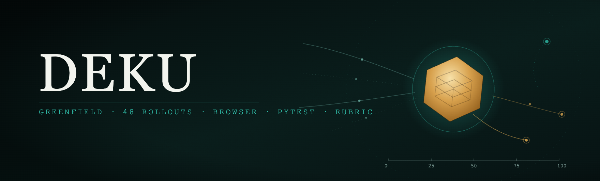
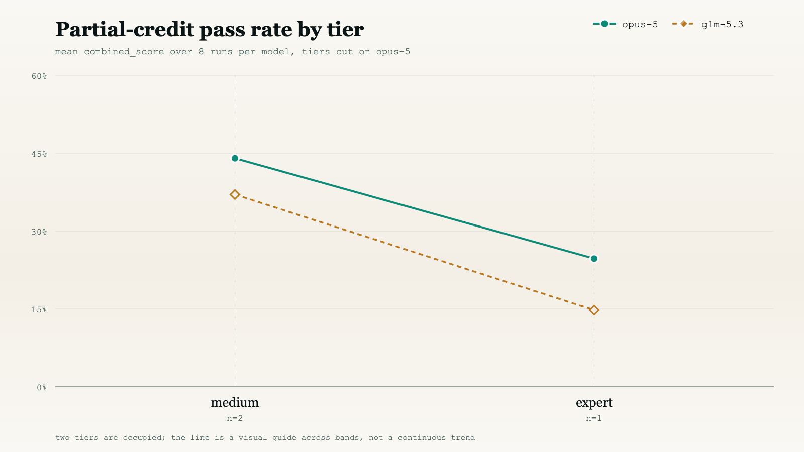
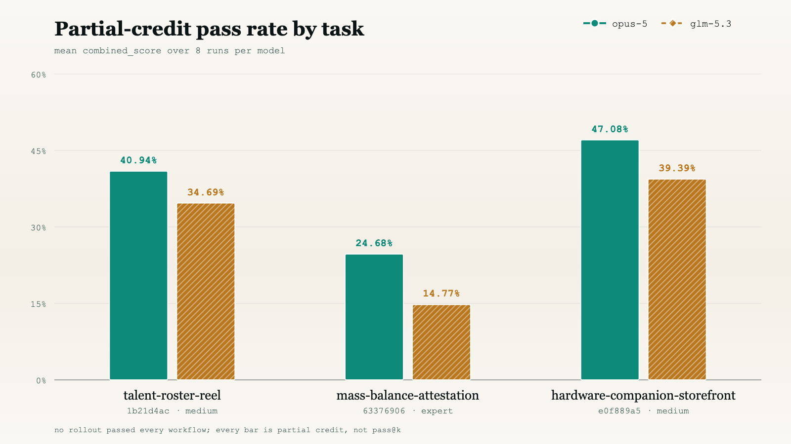
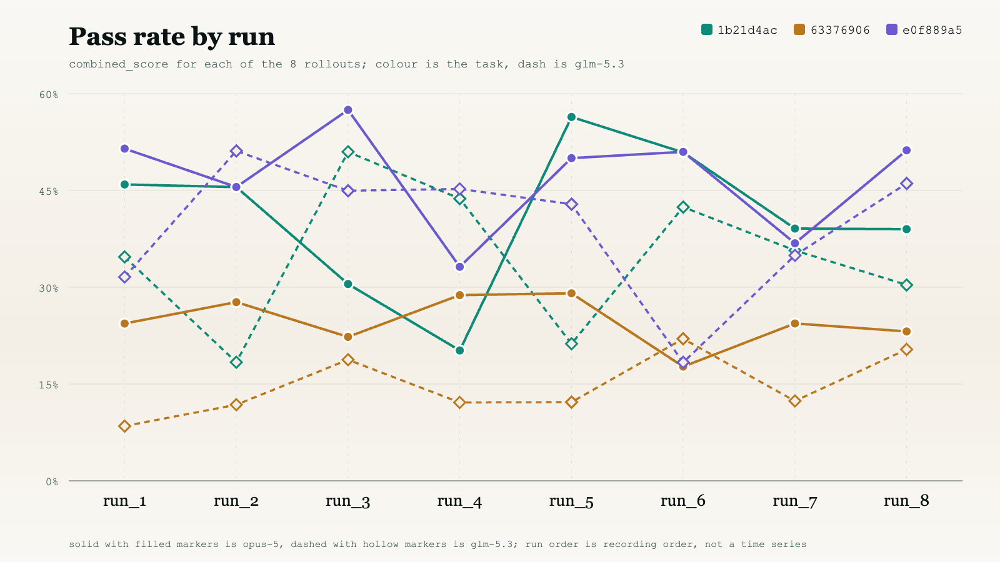
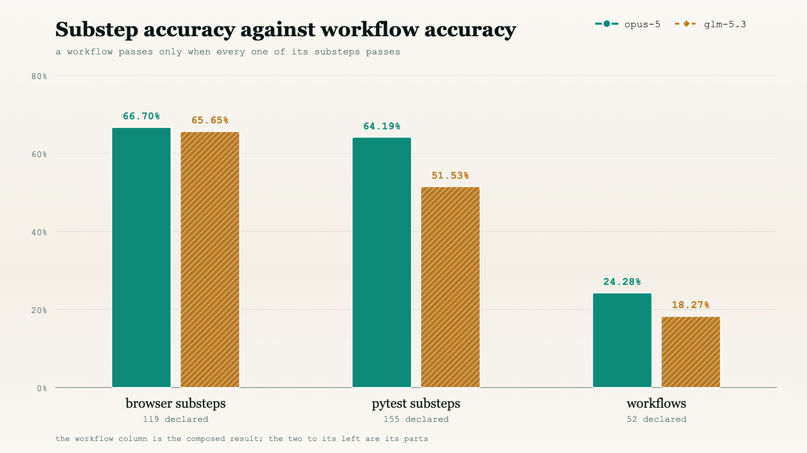
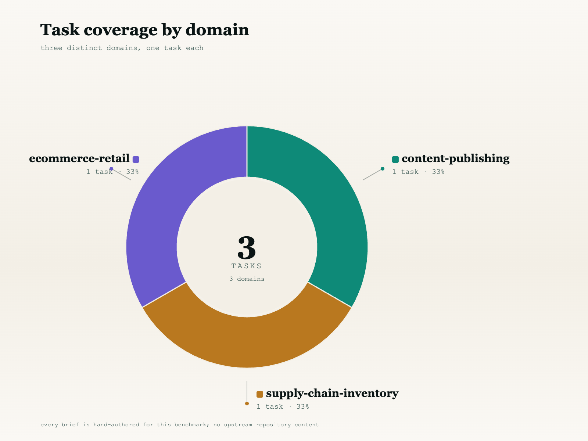
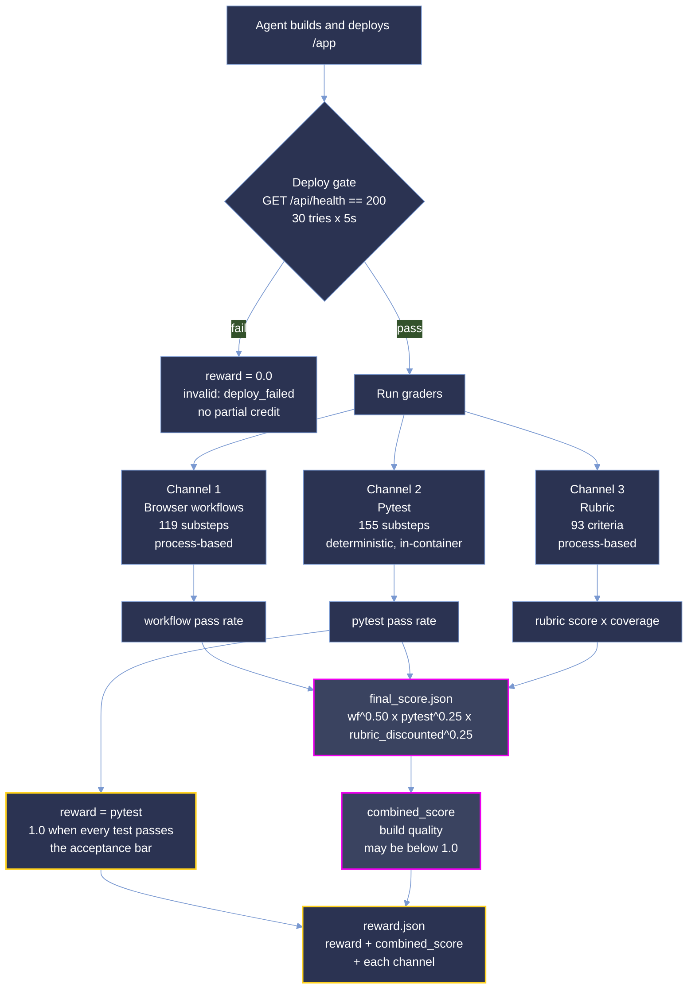

<p align="center">
  <picture>
    <source type="image/svg+xml" srcset="images/hero.svg">
    
  </picture>
</p>

<p align="center">
  <strong>Measuring whether a coding agent can build a working web application from a prose brief alone.</strong>
</p>

<p align="center">
  <a href="#summary"></a>
  <a href="#scoring-methodology"></a>
  <a href="#difficulty-tiers"></a>
  <a href="#reproduction"></a>
</p>

<p align="center"><sub>
  <a href="#summary">Summary</a> · <a href="#repository-layout">Layout</a> · <a href="#difficulty-tiers">Tiers</a> · <a href="#results">Results</a> · <a href="#analysis">Analysis</a> · <a href="#coverage">Coverage</a> · <a href="#dataset-structure">Dataset</a> · <a href="#trajectory-structure">Trajectories</a> · <a href="#scoring-methodology">Scoring</a> · <a href="#reproduction">Reproduction</a> · <a href="#verification">Verification</a> · <a href="#limitations">Limitations</a>
</sub></p>

# DEKU: 3-Task Greenfield Application Build Sample

**DEKU measures whether a coding agent can turn a prose product brief into a deployed, working web
application that a stranger can drive in a browser.**

Each task hands an agent a 47-94 KB specification, an empty `/app` and a service stack, and asks it
to ship something that boots, answers an HTTP health probe, and survives a live browser walkthrough
of its own user flows. There is no repository to patch, no failing test to flip and no oracle diff to
approximate. The hard part of every brief sits deliberately outside the app's own screens: `e0f889a5`
must prove an invoice really landed in Kill Bill ("a confirmation the app returns to itself does not
count"), `1b21d4ac` must make an unlisted record *absent* rather than merely unlinked, including its
generated media, and `63376906` must keep a mass-balance ledger that refuses an over-allocation
rather than warning about it.

This sample is narrow and deep: **3 tasks × 2 models × 8 runs = 48 graded rollouts.** The budget goes
on repetition rather than breadth, so difficulty is a measured rate over eight attempts rather than a
single observation. The three tasks span three domains, two languages and two sub-categories, and
land in two bands of opus-5's measured pass rate. Both cohorts, `opus-5` and `glm-5.3`, run the same
briefs through the same graders, so the two are directly comparable.

**Not one of the 48 rollouts passed every workflow.** Strict all-or-nothing scoring is therefore `0`
everywhere and carries no signal. Throughout this document **pass rate is the mean `combined_score`
over a task's 8 runs for a given model**, as a percentage:

```
pass_rate(task, model) = mean( combined_score over that model's 8 runs on that task )
```

**This is *not* pass@k.** It is a partial-credit rate: a run scoring 40% contributes 40, not 0. It is
the same number the difficulty bands are cut on, and the number the 48 archived runs' `reward.json`
carries. The current grader reports `combined_score` unchanged but derives `reward` from pytest alone;
see [The reward contract](#the-reward-contract).

> **This is a curated, quality-controlled sample of the DEKU corpus,** provided for evaluation. The
> dataset format, trajectory format and scoring are identical to the production benchmark.

## Summary

| Property | Value |
| --- | --- |
| Tasks | 3 |
| Models | `opus-5`, `glm-5.3` |
| Runs per task per model | 8 |
| Graded rollouts | 48 |
| Languages | Python (1), TypeScript (2) |
| Grader version | 0.23.0 |
| Harbor version | 0.23.0 |
| Reward signal | `reward` = pytest pass rate; `combined_score` = all three channels |
| Specification volume | 218,024 bytes (213 KB) across 3 briefs |
| Sample size on disk | 5,936 files, 436 MiB |

| Metric | `opus-5` (n=24) | `glm-5.3` (n=24) |
| --- | ---: | ---: |
| **Pass rate**, mean `combined_score` | **37.57%** | **29.62%** |
| Pass rate range | 0.1770 to 0.5748 | 0.0849 to 0.5113 |
| Workflow channel | 25.92% | 20.28% |
| Workflows passed | 101 / 416 | 76 / 416 |
| Substeps passed | 1,431 / 2,192 | 1,264 / 2,192 |
| Rubric resolution | 100% | 100% |

Across all 48 rollouts the corpus pass rate is **33.59%**, with σ 0.1367 and a range of 0.0849 to
0.5748. `opus-5` leads `glm-5.3` by 7.95 points overall, and unlike a split verdict that margin is
carried in the same direction by all three tasks; see [Results](#results).

Pass rate is `combined_score` from `final_score.json`, a weighted geometric mean of the three grading
channels:

```
combined_score = workflow^0.50 · pytest^0.25 · (rubric × rubric_coverage)^0.25
```

**The 48 archived runs' `reward.json` carries that same `combined_score`,** as each run's `note` field
states explicitly. The workflow pass rate on its own is available as `components.workflow.score`.

## The reward contract

`combined_score` answers *how well was this app built*. `reward` answers *did the machine-checkable
part pass*. They are deliberately different numbers, and only the second one gates.

```
reward         = pytest pass rate                                  ← the training signal
combined_score = workflow^0.50 · pytest^0.25 · rubric_discounted^0.25
```

**All pytest tests pass ⇒ `reward` is exactly 1.0.** That is the acceptance bar: a task does not ship
unless its reference solution reaches `reward == 1.0`. pytest is the only channel graded
deterministically inside the verifier container, with no API key and no network access, so a user
on stock Harbor reproduces that number exactly, and a failure is always a real defect rather than a
disagreement.

**`combined_score` may or may not reach 1.0 on that same run, and that is expected.** The workflow and
rubric channels are *process-based*: they ask whether a journey reads correctly when driven end to
end and whether a criterion is satisfied in spirit, not whether an assertion returned true. A correct
application can lose a workflow substep or a rubric criterion on a borderline reading. The reference
solution for `1b21d4ac` is the worked example: pytest 43/43, but workflow 12/13 and therefore
`combined_score` 0.9608:

| channel | graded by | oracle result | nature |
| --- | --- | ---: | --- |
| pytest | the container, deterministically | 43 / 43 → 1.0 | assertion-based |
| workflow | against recorded evidence | 12 / 13 → 0.9231 | process-based |
| rubric | against recorded evidence | 28 / 28 → 1.0 | process-based |
| | | `reward` **1.0** · `combined_score` 0.9608 | |

So a sub-1.0 `combined_score` on the oracle is a reading of the softer channels, not evidence the task
is broken. Gating on `reward` keeps a single process-based verdict from blocking a shipped task, while
`combined_score` stays recorded as the richer measure of build quality.

**The two process-based channels only run if a grader is available.** `tests/test.sh` checks for a
grader API key and, when none of them is set, skips the workflow and rubric graders while still
running pytest:

```
no grader API key set (ANTHROPIC_API_KEY / OPENAI_API_KEY / GEMINI_API_KEY / DEKU_LLM_API_KEY) - skipping workflow and rubric channels; pytest still graded
```

That is the default path for a user on stock Harbor with no credentials, and it is deliberate:

| | pytest | workflow | rubric | `reward` | `combined_score` |
| --- | --- | --- | --- | --- | --- |
| no grader key | runs | skipped | skipped | pytest pass rate | *omitted*, channels pending |
| with a grader | runs | runs | runs | pytest pass rate | all three channels |

`reward` means the same thing either way, so the oracle reaches 1.0 with or without credentials and a
user reproduces the acceptance verdict without an API key. Supplying a grader adds `combined_score`
and the per-channel detail; it never changes `reward`.

### Choosing the grading model

`DEKU_GRADER_MODEL` and `DEKU_JUDGE_MODEL` name a model the way Harbor does, `<provider>/<model>`.
Both are empty in `task.toml`; left unset they fall back to the graders' own default,
`anthropic/claude-sonnet-4-6`. The provider follows from the name, so setting the matching key is the
whole configuration:

| provider | model example | API key | base URL override |
| --- | --- | --- | --- |
| `anthropic` | `anthropic/claude-sonnet-4-6` | `ANTHROPIC_API_KEY` | `ANTHROPIC_BASE_URL` |
| `openai` | `openai/gpt-4o` | `OPENAI_API_KEY` | `OPENAI_BASE_URL` |
| `gemini` | `gemini/gemini-3.8-flash` | `GEMINI_API_KEY` | `GEMINI_BASE_URL` |
| anything else | `mygateway/some-model` | `DEKU_LLM_API_KEY` | `DEKU_LLM_BASE_URL` (required) |

Every entry in `[verifier].env` is a `${VAR:-default}` template that Harbor resolves from the host
environment, so these are ordinary exports:

```bash
export DEKU_GRADER_MODEL=gemini/gemini-3.8-flash
export DEKU_JUDGE_MODEL=gemini/gemini-3.8-flash
export GEMINI_API_KEY=...
harbor run --path <task-dir>
```

A provider name this bundle does not recognise is treated as an OpenAI-compatible endpoint, so any
gateway that speaks Chat Completions works from a name, a key and a base URL without a code change.
Nothing is baked in: every key defaults to empty, and no credential ships in the bundle.

One provider difference is worth knowing. Gemini is reached through Google's own OpenAI-compatible
surface, which rejects the `seed` parameter outright, so the graders omit it there and record
`grader_seed_applied: false` rather than claim a seed that never took effect.

`reward.json` carries both, plus each channel, so nothing has to be recomputed to read a run:

```json
{"reward": 1.0, "combined_score": 0.9608, "workflow": 0.9231, "pytest": 1.0, "rubric": 1.0}
```

Harbor treats the key named `reward` as the primary signal and ignores the rest, so the extra keys are
reporting only. A channel still pending review is **omitted rather than written `null`**: Harbor
rejects a null or non-finite reward value and discards the whole trial, so `combined_score` disappears
from this file while any channel is unresolved instead of appearing as `null`.

## Repository layout

```
deku-samples/
├── README.md                 # this document
├── images/                   # charts ship in -light and -dark variants
│   ├── hero.{svg,png}
│   ├── pass_rate_by_model-{light,dark}.{svg,png}
│   ├── pass_rate_by_run-{light,dark}.{svg,png}
│   ├── pass_rate_by_tier-{light,dark}.{svg,png}
│   ├── composition_gap-{light,dark}.{svg,png}
│   └── tasks_by_domain-{light,dark}.{svg,png}
└── <uuid>/                   # one self-contained directory per task (3)
    ├── task.toml, instruction.md, environment/, solution/, tests/
    └── trajectories/
        ├── opus-5/run_1 … run_8
        └── glm-5.3/run_1 … run_8
```

Task directories are named by UUID, and every task is referred to by its UUID prefix throughout this
document: `1b21d4ac` is `deku/talent-roster-reel` (python), `63376906` is
`deku/mass-balance-attestation` (typescript) and `e0f889a5` is `deku/hardware-companion-storefront`
(typescript). Each directory is a self-contained bundle: the brief, the environment that hosts it,
the reference solution, the grader, and all sixteen trajectories recorded against it.

Every chart below is derived from the shipped `final_score.json`, `workflows.json` and `usage.json`
files, read directly from the run directories. Nothing in the figures is hand-entered. The banner is
hand-drawn artwork and carries no data.

Every results figure shows both cohorts. `tasks_by_domain` is the one exception: it describes corpus
composition rather than results, and has no model dimension.

## Difficulty tiers

A tier is a **band on a measured rate**, the mean `combined_score` over eight runs:

| band | mean `combined_score` |
|---|---|
| `trivial` | ≥ 87.5% |
| `easy` | [50%, 87.5%) |
| `medium` | [37.5%, 50%) |
| `hard` | [25%, 37.5%) |
| `expert` | < 25% |

| tier | tasks |
|---|--:|
| `medium` | 2 |
| `expert` | 1 |

| task | `opus-5` pass rate | tier | `glm-5.3` pass rate | tier if cut on `glm-5.3` |
|---|--:|---|--:|---|
| `e0f889a5` hardware-companion-storefront | 47.08% | `medium` | 39.39% | `medium` |
| `1b21d4ac` talent-roster-reel | 40.94% | `medium` | 34.69% | `hard` |
| `63376906` mass-balance-attestation | 24.68% | `expert` | 14.77% | `expert` |

<picture>
  <source type="image/svg+xml" media="(prefers-color-scheme: dark)" srcset="images/pass_rate_by_tier-dark.svg">
  <source type="image/svg+xml" srcset="images/pass_rate_by_tier-light.svg">
  <source media="(prefers-color-scheme: dark)" srcset="images/pass_rate_by_tier-dark.png">
  <source media="(prefers-color-scheme: light)" srcset="images/pass_rate_by_tier-light.png">
  
</picture>

`[metadata].difficulty` is the only difficulty label `task.toml` ships, and it is cut on `opus-5`'s
mean over eight runs, the same rate reported in the second column. `reference_model_used` records
that choice explicitly. Each bundle stores the rate beside its label as `pass_rate`, `pass_rate_ci`
and `calibration_trials`; all three `pass_rate` values reproduce exactly from the eight `opus-5`
scores shipped beside them, so the banding can be checked against the scores rather than taken on
trust.

**The shipped tiers are not re-cut on `glm-5.3`, and the banding does not fully agree.** The fourth
column shows where each task would land if they were: `1b21d4ac` drops out of `medium` into `hard` at
34.69%, while the other two hold their band. Treat `difficulty` as an `opus-5` label throughout.

No task lands in `trivial`, `easy` or `hard` under `opus-5`.

## Results

### Partial-credit pass rate by task and model

| Task | Model | Pass rate | σ | Range | Workflow | Pytest | Rubric | Coverage |
| --- | --- | ---: | ---: | --- | ---: | ---: | ---: | ---: |
| `e0f889a5` hardware-companion-storefront | `opus-5` | 47.08% | 0.0767 | 0.332-0.575 | 0.3672 | 0.6830 | 0.5451 | 1.000 |
| `e0f889a5` hardware-companion-storefront | `glm-5.3` | 39.39% | 0.0990 | 0.183-0.511 | 0.3125 | 0.6116 | 0.4722 | 1.000 |
| `1b21d4ac` talent-roster-reel | `opus-5` | 40.94% | 0.1078 | 0.202-0.564 | 0.2692 | 0.8227 | 0.5128 | 1.000 |
| `1b21d4ac` talent-roster-reel | `glm-5.3` | 34.69% | 0.1045 | 0.184-0.510 | 0.2308 | 0.7529 | 0.4031 | 1.000 |
| `63376906` mass-balance-attestation | `opus-5` | 24.68% | 0.0357 | 0.177-0.291 | 0.1413 | 0.5357 | 0.3512 | 1.000 |
| `63376906` mass-balance-attestation | `glm-5.3` | 14.77% | 0.0457 | 0.085-0.220 | 0.0652 | 0.3616 | 0.3461 | 1.000 |

<picture>
  <source type="image/svg+xml" media="(prefers-color-scheme: dark)" srcset="images/pass_rate_by_model-dark.svg">
  <source type="image/svg+xml" srcset="images/pass_rate_by_model-light.svg">
  <source media="(prefers-color-scheme: dark)" srcset="images/pass_rate_by_model-dark.png">
  <source media="(prefers-color-scheme: light)" srcset="images/pass_rate_by_model-light.png">
  
</picture>

`63376906` is the wall, under both models. It is the only enterprise task, the only one requiring
Keycloak, and it marks **84 of its 121 substeps critical**, a design in which almost nothing is
allowed to be partially right. `opus-5` never cleared 29.1% across eight runs, `glm-5.3` never
cleared 22.0%, and σ of 0.0357 and 0.0457 say each model failed in the same place every time. That is
a structural block, not variance.

For `opus-5` the top two tasks are 6.14 points apart against σ of 0.077 and 0.108 on n=8, so they
sit inside each other's spread and should be read as close rather than cleanly ranked. `glm-5.3`
separates them by a similar 4.70 points.

The pytest and workflow channels disagree sharply on `1b21d4ac`: it has the highest pytest score in
the corpus under both models (0.8227 and 0.7529) and only a middling workflow score (0.2692 and
0.2308). Under a geometric mean the workflow term dominates, which is why it ranks below `e0f889a5`
despite passing far more individual tests.

### Model comparison

| Task | `opus-5` | `glm-5.3` | Δ |
| --- | ---: | ---: | ---: |
| `e0f889a5` hardware-companion-storefront | 47.08% | 39.39% | -7.69 |
| `1b21d4ac` talent-roster-reel | 40.94% | 34.69% | -6.25 |
| `63376906` mass-balance-attestation | 24.68% | 14.77% | -9.92 |
| **Corpus** | **37.57%** | **29.62%** | **-7.95** |

**`opus-5` leads on every task, but only `63376906` separates the two models beyond their own
noise.** The 6.25-point gap on `1b21d4ac` sits well inside a σ of 0.105 on n=8 and should be read as
a tie. `e0f889a5` at 7.69 points against σ of 0.077 and 0.099 is suggestive but not decisive. The
9.92-point gap on `63376906` is more than twice its σ of 0.036 and 0.046, and it is the only one of
the three that survives its own spread. A two-model, three-task sample cannot support a general
ranking claim; what it shows is a consistent direction with one statistically solid instance.

### Per-run pass rate

Each cell is that run's `combined_score`. In the figure, solid lines with filled markers are
`opus-5` and dashed lines with hollow markers are `glm-5.3`; colour identifies the task.

<picture>
  <source type="image/svg+xml" media="(prefers-color-scheme: dark)" srcset="images/pass_rate_by_run-dark.svg">
  <source type="image/svg+xml" srcset="images/pass_rate_by_run-light.svg">
  <source media="(prefers-color-scheme: dark)" srcset="images/pass_rate_by_run-dark.png">
  <source media="(prefers-color-scheme: light)" srcset="images/pass_rate_by_run-light.png">
  
</picture>

`opus-5`:

| Task | run_1 | run_2 | run_3 | run_4 | run_5 | run_6 | run_7 | run_8 |
| --- | ---: | ---: | ---: | ---: | ---: | ---: | ---: | ---: |
| `1b21d4ac` | 0.459 | 0.455 | 0.305 | 0.202 | 0.564 | 0.509 | 0.391 | 0.390 |
| `63376906` | 0.244 | 0.277 | 0.223 | 0.288 | 0.291 | 0.177 | 0.244 | 0.232 |
| `e0f889a5` | 0.515 | 0.455 | 0.575 | 0.332 | 0.500 | 0.510 | 0.368 | 0.512 |

`glm-5.3`:

| Task | run_1 | run_2 | run_3 | run_4 | run_5 | run_6 | run_7 | run_8 |
| --- | ---: | ---: | ---: | ---: | ---: | ---: | ---: | ---: |
| `1b21d4ac` | 0.347 | 0.184 | 0.510 | 0.437 | 0.212 | 0.424 | 0.357 | 0.304 |
| `63376906` | 0.085 | 0.118 | 0.188 | 0.121 | 0.122 | 0.220 | 0.124 | 0.204 |
| `e0f889a5` | 0.316 | 0.511 | 0.450 | 0.452 | 0.429 | 0.183 | 0.349 | 0.461 |

**No run scored 1.0 and no run scored 0.0** under either model. The corpus has neither a ceiling nor
a floor effect.

All 48 runs scored under the full exponents `{workflow 0.50, pytest 0.25, rubric 0.25}`: the rubric
channel resolved on every run, so `weights_applied` never renormalised. The lowest channel value
anywhere in the corpus is a workflow score of 0.0435, exactly 1/23, one workflow of twenty-three,
shared by five of `glm-5.3`'s eight runs on `63376906` (runs 1, 2, 4, 5 and 7), so no run approached
the zero that would collapse the product.

## Analysis

**Substep accuracy does not survive composition.** `opus-5` passes 66.7% of browser substeps and
64.2% of pytest substeps, yet only **24.3% of workflows**. `glm-5.3` shows the same shape: 65.7%
browser, 51.5% pytest, **18.3% workflows**. A workflow passes only when *every* substep in it
passes, so partial competence collapses at the join. This gap is the single most important thing to
understand about the benchmark: agents are broadly capable and narrowly reliable, and that holds for
both models.

| Channel | `opus-5` | `glm-5.3` |
| --- | ---: | ---: |
| Workflows | 101 / 416 (24.28%) | 76 / 416 (18.27%) |
| Browser substeps | 635 / 952 (66.70%) | 625 / 952 (65.65%) |
| Pytest substeps | 796 / 1,240 (64.19%) | 639 / 1,240 (51.53%) |
| Critical substep failures | 427 | 573 |

<picture>
  <source type="image/svg+xml" media="(prefers-color-scheme: dark)" srcset="images/composition_gap-dark.svg">
  <source type="image/svg+xml" srcset="images/composition_gap-light.svg">
  <source media="(prefers-color-scheme: dark)" srcset="images/composition_gap-dark.png">
  <source media="(prefers-color-scheme: light)" srcset="images/composition_gap-light.png">
  
</picture>

The workflow column is the dominant term in the score. Everything to its left is competence the
agent demonstrated but could not compose into a passing flow.

**The browser channel barely separates the two models; pytest does.** Browser substeps differ by
1.05 points (66.70% against 65.65%) while pytest differs by 12.66 (64.19% against 51.53%). Whatever
distinguishes these two cohorts shows up in the assertions made against the datastore and the API,
not in what a browser can see on the page.

**Critical failures concentrate almost entirely in one task.** For `opus-5`, 312 of 427 critical
substep failures (73%) belong to `63376906`, an average of 39 per run against the 84 it marks
critical; the other two tasks contribute 44 and 71 across all eight runs each. `glm-5.3` concentrates
harder still: 429 of 573 (75%), with 57 and 87 elsewhere.

**The rubric channel resolves completely, for both models.** Every task settles **100%** of its
criteria under each cohort, with zero unresolved criteria across all 744 verdicts per model:

| | `opus-5` | `glm-5.3` |
| --- | ---: | ---: |
| Criteria evaluated | 744 | 744 |
| PASS / FAIL | 388 / 356 | 337 / 407 |
| Unresolved | 0 | 0 |
| `rubric_coverage` | 1.000 on every run | 1.000 on every run |

Because coverage is 1.0 on every run, the `rubric_coverage` discount is inert throughout this sample:
no run loses rubric credit to a grader blind spot, and the rubric column is directly comparable
across all three tasks.

**`opus-5` leads on all three channels.** Its rubric means are 0.5128, 0.5451 and 0.3512 against
`glm-5.3`'s 0.4031, 0.4722 and 0.3461, so unlike a split verdict there is no channel in which the
cheaper cohort scores higher. The overall margin is a consistent, if mostly sub-σ, advantage rather
than a trade-off.

**Rubric scores are lower than workflow-adjacent intuition suggests.** With nothing excluded for
being unobservable, `opus-5`'s rubric channel lands at 0.5128, 0.3512 and 0.5451, under each task's
pytest rate. A fully resolved rubric is a harsher rubric: criteria that a partially-blind grader
would previously have dropped are now settled, and a majority of them settle as `FAIL` for
`glm-5.3` (407 of 744).

**Deploy is a cliff, not a slope.** `tests/test.sh` polls `${APP_PUBLIC_URL}/api/health` for HTTP 200
(30 attempts at 5-second intervals, with a `GET /` fallback only when the probe answers 404) before
any grading runs. An app that misses that gate is written out with `invalid: ["deploy_failed"]` and
scores zero, with no partial credit for code that would have worked. All 48 rollouts cleared it,
though one needed two attempts; see [Verification](#verification).

**The grader records more than it trains on.** Harbor trains on the `reward` key alone, the pytest
pass rate, but `reward.json` also carries `combined_score` and each channel; the scores that produced
them stay in `final_score.json` under `components`, and the browser, pytest and rubric evidence that
produced *those* stays in `verifier/`. Every number in the chain is auditable back to a recorded
observation, and the softer channels are reported rather than trained on precisely because they are
process-based.

## Coverage

<picture>
  <source type="image/svg+xml" media="(prefers-color-scheme: dark)" srcset="images/tasks_by_domain-dark.svg">
  <source type="image/svg+xml" srcset="images/tasks_by_domain-light.svg">
  <source media="(prefers-color-scheme: dark)" srcset="images/tasks_by_domain-dark.png">
  <source media="(prefers-color-scheme: light)" srcset="images/tasks_by_domain-light.png">
  
</picture>

| Axis | Distribution |
| --- | --- |
| Language | typescript 2, python 1 |
| Sub-category | solo_founder 2, enterprise 1 |
| Service profile | P1-db, P5-db-pay-email, P6-db-auth-email |
| Services | postgres 3, mailpit 2, keycloak 1, killbill 1 |
| Design direction | editorial-serif 2, dense-ops-console 1 |
| Capability flags | aesthetic 3, plus concurrency_hardening / observability / data_scale on `e0f889a5` |
| Spec sections given | all 10, on all 3 tasks |

Every task ships the full ten-section brief: overview, roles, features, flow, uiux, frontend,
techrequirements, datamodel, constraints, contract.

### Full task list

| UUID | Name | Lang | Domain / pattern | Services | Workflows | Substeps | Critical | Rubric | Reqs | Turns | Tokens |
| --- | --- | --- | --- | --- | ---: | ---: | ---: | ---: | ---: | ---: | ---: |
| `1b21d4ac` | deku/talent-roster-reel | python | content-publishing / directory-matching | postgres | 13 | 93 | 25 | 28 | 135 | 120 | 4.5M |
| `63376906` | deku/mass-balance-attestation | typescript | supply-chain-inventory / inventory-allocation | postgres, keycloak, mailpit | 23 | 121 | 84 | 39 | 137 | 200 | 8.0M |
| `e0f889a5` | deku/hardware-companion-storefront | typescript | ecommerce-retail / commerce-checkout | postgres, killbill, mailpit | 16 | 60 | 28 | 26 | 73 | 200 | 7.5M |

Totals: **52 workflows**, **274 substeps** (155 pytest, 119 browser), **137 critical**, **93 rubric
criteria**, **345 traceability rows** of which 339 carry a `YES` verdict.

## Dataset structure

```
<task-uuid>/
├── task.toml                   schema 1.4 task definition
├── instruction.md              the brief (47-94 KB)
├── environment/
│   ├── Dockerfile
│   ├── docker-compose.yaml
│   ├── postgres-init.sql
│   ├── keycloak-realm.json          (63376906 only)
│   └── killbill-init.sh, killbill-shiro.ini   (e0f889a5 only)
├── solution/
│   ├── TRUTH.md                reference behaviour narrative
│   ├── app/                    USER_README.md, run.json, the reference build
│   ├── checklist.md
│   └── solve.sh
├── tests/
│   ├── test.sh, conftest.py
│   ├── workflows.yaml          browser + pytest substeps, cov: requirement IDs
│   ├── rubric.json             rubric criteria
│   ├── test_output.py          the pytest module, same filename in every bundle
│   ├── traceability-matrix.csv requirement → T*/W*/R* coverage matrix
│   └── grader/                 score.py, run_workflows.py, run_rubric.py
│                               and the evidence pipeline
└── trajectories/
    ├── opus-5/run_1…run_8/
    └── glm-5.3/run_1…run_8/
```

`instruction.md` is the contract. `workflows.yaml` is the grader. `traceability-matrix.csv` is the
proof that every clause of the former is reachable by the latter: each row maps a requirement to the
specific tests (`T1…`), workflows (`W1…`) and rubric criteria (`R1…`) that exercise it.

`solution/app/run.json` is a `run-manifest-v1` declaring how the reference build installs, builds and
serves: for `1b21d4ac`, `pip install --no-cache-dir -r requirements.txt` then
`python -m gunicorn --bind 0.0.0.0:${APP_PUBLIC_PORT} app:app`.

## Trajectory structure

```
run_N/
├── reward.json          {"reward": <combined_score>}   ← archived runs; see note below
├── final_score.json     combined_score and per-channel breakdown
├── workflows.json       summary + per-workflow, per-substep verdicts
├── usage.json           token counts under sources.agent
├── app/                 the application the agent built
├── screenshots/         NN_route_WxH.png at 1920x1200, 768x1024, 390x844
├── trajectory/
│   └── trajectory.json
└── verifier/
    ├── browser_results.json     per-workflow marks and evidence
    ├── ctrf.json                CTRF-format test report
    └── judge.json               per-criterion rubric verdicts, rationale and evidence
```

The 48 archived `reward.json` files predate [the reward contract](#the-reward-contract) and hold a
single key equal to `combined_score`. The current grader writes `reward` (pytest), `combined_score` and
the three channel scores into that same file; `final_score.json` is unchanged in both.

The sample carries **1,317 screenshots** across the 48 rollouts, 684 for `opus-5` and 633 for
`glm-5.3`, captured at three viewports per route so responsive criteria are evaluated from real renders
rather than CSS inspection. These are the verifier's own captures; any agent-side captures under a
run's `app/` are build artifacts and are not counted here.

`judge.json` carries, for every criterion, the `evaluation_rule` it was evaluated against, a
`rationale`, and an `evidence` array quoting the routes visited and the DOM observed. Its `meta`
block records the viewports, the routes visited and, where a prior evidence bundle was reused, which
criteria were carried forward and which were regraded.

## Scoring methodology

Three channels are computed per run over three different objects (the running application, the
delivered source, and the recorded evidence), all behind a hard deploy gate. They compose into the
headline number as a weighted geometric mean.

Only one of the three is machine-produced, and that asymmetry is why `reward` is derived from pytest
alone. Pytest is executed by the verifier container. The browser workflow and rubric channels are
**process-based**: each is settled against recorded evidence, written to `browser_results.json` and
`judge.json` respectively, and `final_score.json` carries the per-channel attribution as
`scoring.workflow_evaluated_by` and `scoring.rubric_evaluated_by` so every verdict stays
traceable.

**A `combined_score` you produce is not interchangeable with an archived one**, because the
process-based channels are resolved independently per run; `meta.evaluated_by` in each evidence file
records which resolution a number came from. `reward` does not have this problem: pytest is
deterministic and identical in both, which is the other reason it is the number that gates.
`score.py` needs no network or credentials to recompute either.



### How the channels combine

`combined_score` is a **weighted geometric mean**, not a weighted average:

```
combined_score = workflow^0.50 · pytest^0.25 · (rubric × rubric_coverage)^0.25
```

Two properties follow, and both are deliberate.

**A weak channel cannot be bought back.** Under an arithmetic mean, a 0.82 pytest score offsets a
0.27 workflow score and the run still reports respectably. Under a geometric mean the product is
dragged toward the weakest term, so the score answers *"was this competent across all three at
once?"* rather than *"how much credit did it accumulate anywhere?"* The penalty relative to an
arithmetic mean scales with how lopsided the run was: 4.0% for the most balanced task and model in
this sample (`opus-5` on `e0f889a5`), 29.5% for the least (`glm-5.3` on `63376906`).

**Rubric credit is proportional to what was observable.** Unresolved criteria are excluded from
`rubric.score`, which would otherwise hand a run full credit for the fraction of the rubric the
grader happened to settle. Multiplying by `rubric_coverage` removes that unearned credit. In this
sample every task resolves its whole rubric under both models, so the multiplier is 1.0 on all 48
rollouts and no run absorbs a discount; the mechanism is retained because it is load-bearing on any
run where a criterion cannot be settled.

Each run records its own arithmetic in `final_score.json` under `scoring`, alongside
`components.rubric.score_discounted`.

### Channel 1: Browser workflows

A workflow passes when **at least 90%** of its graded substeps pass **and no critical substep
fails** (`WORKFLOW_PASS_RATIO = 0.90` in `score.py`), and the workflow pass rate carries the largest
exponent in the product. The threshold is not merely nominal: 17 workflow instances in the shipped
runs report `passed: true` at a ratio of exactly 0.90, having failed one non-critical substep of ten.
Each workflow records its own `substeps_passed`, `substeps_graded`, `ratio` and `critical_failed` in
`workflows.json`, so the verdict can be rederived. Substeps declare `kind: browser` or
`kind: pytest`, an optional `critical: true`, and a `cov:` list of requirement IDs. 119 of the 274
substeps are exercised through a real browser against the running app, at three viewports, and marked
in `browser_results.json`.

### Channel 2: Machine-run pytest

The one channel settled entirely inside the container. 155 substeps execute as pytest cases inside the verifier
container, producing 1,240 test results per
model (`opus-5`: 796 passed, 444 failed; `glm-5.3`: 639 passed, 601 failed; **0 skipped, 0 pending,
0 other** in both). `test.sh` deliberately omits `set -e`: a failing test is a *score*, not a harness
error. The script writes `{"reward": 0.0}` before anything else runs, so every exit path leaves a
reward file behind.

### Channel 3: Rubric

93 criteria, two of them **negative** criteria that penalise behaviour rather than reward it. The
rubric carries source-quality dimensions alongside behavioural ones:

| Dimension | Criteria | | Dimension | Criteria |
| --- | ---: | --- | --- | ---: |
| internal_consistency | 16 | | ux_flow | 7 |
| ui_visual | 14 | | responsiveness | 6 |
| scope_discipline | 13 | | motion | 5 |
| instruction_following | 11 | | accessibility | 5 |
| functionality | 11 | | abstraction, dead_code, naming, readability, idiomaticity | 1 each |

Importance splits 39 important / 30 critically_important / 24 somewhat_important. Evaluation targets
are `state_change` (57), `user_facing_message` (33) and `trajectory` (3). Each criterion carries an
explicit `evaluation_rule` that fixes what counts as a pass, so a verdict can be argued with rather
than only accepted; `judge.json` records the rule, the verdict, a rationale and the evidence behind
it. Across all 744 verdicts per model every criterion resolved to a PASS or a FAIL, and
`rubric_coverage` is 1.0 on every run. When a channel does fully unresolve, `rubric.score` is `null`,
the rubric key drops out of `weights_applied`, and the remaining exponents renormalise to sum to 1.0.
That path was **not** exercised here.

### Baselines: oracle and nop

Pytest is the only channel a machine can settle. With neither `browser_results.json` nor
`judge.json` on disk both process-based channels report `missing` and `combined_score` goes `null` rather
than 0, while the weights renormalise onto what was actually graded -- `weights_applied` becomes
`{"pytest": 1.0}` -- so `reward` is the pytest pass rate on its own. That is the same number the
reward contract above gates on, which is why an unattended user reproduces the acceptance verdict
without a grader.

| Baseline | `combined_score` | `reward` | `scoring.basis` |
| --- | ---: | ---: | --- |
| `oracle`, unattended | `null` | **1.0** | `partial_pending_review: workflow, rubric` |
| `oracle`, all three channels graded | **1.0** | 1.0 | `complete` |
| `nop` | **0.0** | 0.0 | `deploy_failed` |

`harbor run -a oracle` therefore validates the plumbing: the reference solution deploys, clears the
health gate and satisfies every machine assertion. It does not certify the brief, which takes one
review pass per task -- that is what `combined_score` staying `null` records, and what
`scoring.basis` names. `reward` separating 1.0 from the `nop` 0.0 is the signal task validation
needs. `score.py --self-test` asserts both halves: a perfect unattended run reports `reward` 1.0
with `weights_applied == {"pytest": 1.0}`, and a 2-of-3 pytest run reports 0.6667.

Channel marks are **per-run artifacts, not task assets**. `browser_results.json` records the
viewport, URL and wall-clock span of one walkthrough, and `judge.json` the routes actually visited
and a rationale per criterion, so both live under `trajectories/<model>/run_<n>/verifier/` and are
deliberately absent from `solution/`: `score.py` performs no provenance check and grades whatever
JSON sits at those paths. `solution/TRUTH.md` is the reference key instead: expected state,
obligation IDs and named pytest checkers, with no machine-readable marks.

## Reproduction

Every figure re-derives from the shipped bytes; no re-execution is needed. All snippets run from the
repository root, using the Python standard library or `jq` over the JSON the bundles already carry.

**Recompute the pass rate for a single task and model:**

```python
import json, pathlib

MODEL = "opus-5"   # or "glm-5.3"
runs = sorted(
    pathlib.Path(f"1b21d4ac-055a-52e7-b754-0620f337b0d4/trajectories/{MODEL}").glob("run_*"),
    key=lambda p: int(p.name.split("_")[1]),
)
scores  = [json.loads((r / "final_score.json").read_text())["combined_score"] for r in runs]
rewards = [json.loads((r / "reward.json").read_text())["reward"] for r in runs]

print(f"n={len(runs)}  pass_rate={sum(scores)/len(scores):.4f}  reward={sum(rewards)/len(rewards):.4f}")
# opus-5  -> n=8  pass_rate=0.4094  reward=0.4094
# glm-5.3 -> n=8  pass_rate=0.3469  reward=0.3469
```

**Rubric resolution across all 48 rollouts:**

```bash
for m in opus-5 glm-5.3; do
  printf '%-8s ' "$m"
  find . -path "*/$m/*" -name final_score.json -print0 \
    | xargs -0 jq -sc '[.[].components.rubric]
                       | {criteria:   map(.criteria)   | add,
                          passed:     map(.passed)     | add,
                          failed:     map(.failed)     | add,
                          unresolved: map(.unresolved) | add}'
done
# -> opus-5   {"criteria":744,"passed":388,"failed":356,"unresolved":0}
# -> glm-5.3  {"criteria":744,"passed":337,"failed":407,"unresolved":0}
```

**Confirm every criterion resolved and coverage never discounted a run:**

```bash
find . -name final_score.json -print0 \
  | xargs -0 jq -s '{runs:         length,
                     unresolved:   map(.components.rubric.unresolved) | add,
                     min_coverage: map(.rubric_coverage)              | min,
                     reward_is_combined:
                       map(select(.reward == .combined_score)) | length}'
# -> {"runs": 48, "unresolved": 0, "min_coverage": 1.0, "reward_is_combined": 48}
```

**Confirm every rollout deployed and none was flagged:**

```bash
find . -name workflows.json -print0 \
  | xargs -0 jq -s '{runs:     length,
                     deployed: map(select(.summary.deployed == 1.0)) | length,
                     degraded: map(select(.summary.degraded != [])) | length,
                     invalid:  map(select(.summary.invalid  != [])) | length,
                     retried:  map(select(.summary.deploy_attempts > 1)) | length}'
# -> {"runs": 48, "deployed": 48, "degraded": 0, "invalid": 0, "retried": 1}
```

**Workflow composition gap, substep accuracy versus workflow accuracy:**

```bash
for m in opus-5 glm-5.3; do
  printf '%-8s ' "$m"
  find . -path "*/$m/*" -name workflows.json -print0 \
    | xargs -0 jq -sc '[.[].summary]
                       | {workflows: "\(map(.workflows_passed)|add)/\(map(.workflows_total)|add)",
                          browser:   "\(map(.browser_substeps_passed)|add)/\(map(.browser_substeps_total)|add)",
                          pytest:    "\(map(.pytest_substeps_passed)|add)/\(map(.pytest_substeps_total)|add)",
                          critical_failed: map(.critical_substeps_failed) | add}'
done
# -> opus-5   {"workflows":"101/416","browser":"635/952","pytest":"796/1240","critical_failed":427}
# -> glm-5.3  {"workflows":"76/416","browser":"625/952","pytest":"639/1240","critical_failed":573}
```

**Regenerate the `.png` fallbacks from the SVGs.** Each `.png` in `images/` is a browser-rendered
export of the `.svg` beside it:

```bash
for f in images/*-light.svg images/*-dark.svg; do
  case "$f" in *tasks_by_domain*) SIZE=1600,1200 ;; *) SIZE=1600,900 ;; esac
  chrome --headless=new --disable-gpu --hide-scrollbars \
         --screenshot="${f%.svg}.png" --window-size=$SIZE "file://$PWD/$f"
done
```

**Derive the unattended ceiling and the `nop` floor, with no Docker and no network:**

```python
import sys; sys.path.insert(0, "1b21d4ac-055a-52e7-b754-0620f337b0d4/tests")
import score

spec    = [{"id": "w", "substeps": [{"kind": "browser", "do": "x"}]}]
perfect = {"results": {"summary": {"tests": 40, "passed": 40, "skipped": 0}}}

print(score.build(perfect, None, None, [], declared=spec)["reward"])
print(score.build(None, None, None, [], declared=spec, deploy_failed=True)["reward"])
print(score.combine(1.0, 1.0, 1.0))
# -> 1.0    oracle, unattended: pytest is the only settled channel, so it carries all the weight
# -> 0.0    nop: deploy_failed, a scored zero rather than a voided run
# -> 1.0    oracle, all three channels graded
```

## Verification

Every claim below was checked against the shipped bytes, across both models unless stated otherwise.

- All 48 rollouts deployed successfully and cleared the `/api/health` gate.
- `invalid = []` and `degraded = []` on every rollout, and `infrastructure_failures = []` on every
  rollout.
- **One rollout needed two deploy attempts**: `glm-5.3` `1b21d4ac` run_3 records
  `deploy_attempt_failures: ["container exited"]` and a `deploy_flake` note stating that every figure
  in that record is conditional on a boot that is not deterministic. The other 47 booted first try.
- All 48 run directories are structurally complete, with no missing `reward.json`,
  `final_score.json`, `workflows.json`, `usage.json`, `verifier/`, `app/`, `screenshots/` or
  `trajectory/`.
- All 48 `trajectory.json` files are present and parse as valid JSON.
- `reward` in `reward.json` equals `combined_score` in `final_score.json` on all 48 archived runs.
  Runs produced after [the reward contract](#the-reward-contract) separate the two by design: `reward`
  is the pytest pass rate and `combined_score` is the three-channel mean.
- `combined_score` recomputes from its three channels on all 48 runs, to within `5e-05`.
- Pytest reported 0 skipped, 0 pending and 0 other across 1,240 test results per model; every result
  is a real pass or a real fail.
- All 744 rubric verdicts per model resolved: `unresolved = 0` on every run and
  `rubric_coverage = 1.0` corpus-wide.
- Every `usage.json` carries a named `sources.agent.model`.
- 339 of 345 traceability rows carry a `YES` verdict.
- `uuid_v5` in each `task.toml` matches its directory name, and each `pass_rate` matches the mean
  `combined_score` of the eight `opus-5` runs shipped beside it: 0.4094, 0.2468 and 0.4708.
- No rollout scored 1.0 or 0.0 under either model, so there is no ceiling or floor saturation.

## Limitations

**Sample size.** Three tasks under two models is a small corpus. Every figure here describes these
three tasks; none of it estimates the wider corpus, and each band rests on one or two tasks, so a
band row is close to a task row.

**No clean solves.** No rollout passed every workflow, so a strict pass/fail metric reports 0% and
separates nothing. The ranking is entirely a partial-credit result, and the corpus cannot distinguish
an agent that nearly finished a task from one that passed a large fraction of its independent checks.

**Two models is not a leaderboard.** On three tasks at n=8, only `63376906` separates `opus-5` from
`glm-5.3` by more than the run-to-run spread. The other two gaps, 6.25 and 7.69 points, sit inside
their own σ. Read the comparison as three paired observations, not a benchmark result.

**Tiers are cut on one model, and do not transfer.** `difficulty`, `pass_rate` and `pass_rate_ci` in
`task.toml` are derived from the `opus-5` runs only, as `reference_model_used` records. Cut on
`glm-5.3` instead, `1b21d4ac` would fall from `medium` to `hard`, so the labels are not
model-independent.

**Calibration provenance is partial.** `difficulty`, `pass_rate`, `pass_rate_ci`,
`reference_model_used`, `calibration_trials` and `calibration_date` are cut from the eight `opus-5`
runs shipped here, with `calibration_date` taken from the archived verifier run timestamps. No
`openhands_version` is recorded, so the calibration cannot be tied to a specific harness build beyond
the `grader_version` and `harbor_version` fields.

**Rubric verdicts are process-based, not assertions.** The rubric channel resolves every criterion,
and `judge.json` ships the rule, rationale and evidence behind each verdict, but a verdict is a
reading of a model's work rather than a deterministic check. They are shipped as recorded results and
will not necessarily reproduce criterion for criterion under a fresh resolution.

**Rubric evidence is reused across runs.** `judge.json`'s `meta.rubric_resume` shows criteria being
carried forward from a prior evidence bundle rather than resolved from scratch, so not every verdict
in a given run was independently derived within that run.

**A fully resolved rubric is a stricter rubric.** Because criteria are no longer dropped for being
unobservable, rubric scores here are not comparable to figures produced under partial coverage. Runs
scored against an earlier, partially-resolved rubric will report higher.

**Uneven browser evidence.** `e0f889a5` captured 7-10 screenshots per run under `opus-5` and 3-9
under `glm-5.3`, against 45-57 and 37-58 for `1b21d4ac` and 27 and 24-27 for `63376906`, so its
visual criteria rest on a far thinner set of renders than the other two tasks even though all of them
resolved.

**No bundle-level checksum manifest.** The bundle carries no top-level index or signed provenance
record, so task checksums cannot be verified from the bundle alone. Per-run evidence is recorded in
full and `score.py` recomputes every reported number from it without network access.

## License

MIT © 2026 Ethara.AI.

Task content, specification briefs and recorded trajectories are released under the same terms.